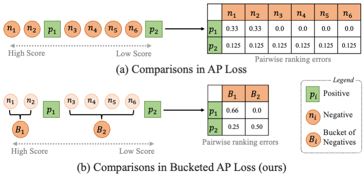
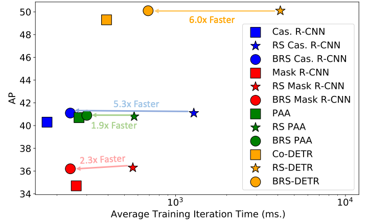

# Bucketed Ranking-based Losses for Efficient Training of Object Detectors

The official implementation of Bucketed Ranking-based Losses. Our implementation is based on [mmdetection](https://github.com/open-mmlab/mmdetection).

> [**Bucketed Ranking-based Losses for Efficient Training of Object Detectors**](https://arxiv.org/abs/2407.14204),            
> Feyza Yavuz, Baris Can Cam, Adnan Harun Dogan, [Kemal Oksuz](https://kemaloksuz.github.io/), [Emre Akbas](http://user.ceng.metu.edu.tr/~emre/), [Sinan Kalkan](http://www.kovan.ceng.metu.edu.tr/~sinan/),
> *ECCV 2024. ([arXiv pre-print](https://arxiv.org/abs/2407.14204))*


## Introduction

**What is Bucketed Ranking-based (BR) Losses?** Bucketing for ranking-based losses enhances the efficiency of such losses in object detection by grouping negative predictions into buckets, significantly reducing the number of pairwise comparisons required during training. Bucketing maintains the alignment with evaluation criteria and robustness against class imbalance of ranking-based loss functions while drastically improving the time complexity.

<p align="center">
  
</p>

**Benefits of BR Loss on Efficiency and Simplification of Training.** With BR Loss, we achieve significant improvements in training efficiency: (i) The bucketed approach reduces the time complexity to O(max(N log(N),P²)), allowing faster training, (ii) BR Loss maintains the simplicity and robustness of ranking-based approaches without requiring complex sampling heuristics or additional auxiliary heads, and (iii) it enables efficient training of large-scale object detectors, including transformer-based models, with minimal tuning.

**Benefits of BR Loss on Improving Performance.** Using BR Loss, we train seven diverse visual detectors and demonstrate consistent performance improvements: (i) BR Loss accelerates training by 2× on average while preserving the accuracy of unbucketed versions, (ii) For the first time, we successfully train transformer-based detectors like CoDETR using ranking-based losses, consistently outperforming their original configurations across multiple backbones.

<p align="center">
  
</p>

## How to Cite

Please cite the paper if you benefit from our paper or the repository:
```
@inproceedings{BRLoss,
       title = {Bucketed Ranking-based Losses for Efficient Training of Object Detectors},
       author = {Feyza Yavuz and Baris Can Cam and Adnan Harun Dogan and Kemal Oksuz and Emre Akbas and Sinan Kalkan},
       booktitle = {European Conference on Computer Vision (ECCV)},
       year = {2024}
}
```
## Specifications of Dependencies and Preparation
- Please see [get_started.md](docs/en/get_started.md) for requirements and installation of mmdetection.
- Please see [introduction.md](docs/en/1_exist_data_model.md) for dataset preparation and basic usage of mmdetection.

Please note that, we implement our method on [MMDetection V2.25.3](https://github.com/open-mmlab/mmdetection/releases/tag/v2.25.3) and [MMCV V1.5.0](https://github.com/open-mmlab/mmcv/releases/tag/v1.5.0). More specifically, we use ```python=3.7.11, pytorch=1.11.0, cuda=11.3``` versions.

## Trained Models
Here, we report validation set results for object detection and instance segmentation tasks. For object detection we report results on COCO validation set. For instance segmentation we report results on both Cityscapes and LVIS validation sets.

We refer to the [RS Loss](http://github.com/kemaloksuz/RankSortLoss) repository for models trained with RS Loss. 

### Multi-stage Object Detection
#### Faster R-CNN

|    Backbone     |  Epoch |  Loss Func. | Time | box AP |  Log  | Config | Model |
| :-------------: | :-----: | :-----: | :------------: | :------------: | :------------: | :-------: | :-------: |
|    ResNet-50 | 12 |  RS  | - | 39.4 |  [log]()| [config]() | [model]() |
|^ | 12 |  BRS  | 3.0x &#8595; | 39.5 |  [log]()| [config]() | [model]() |
|    ResNet-101 | 36 |  RS  | - | 47.3 |  [log]()| [config]() | [model]() |
|^ | 36 |  BRS  | 2.0x &#8595; | 47.7 |  [log]()| [config]() | [model]() |

#### Cascade R-CNN


### One-stage Object Detection


## Licence
This project is released under the MIT license. Please see the [LICENSE](LICENSE) file for more information.
