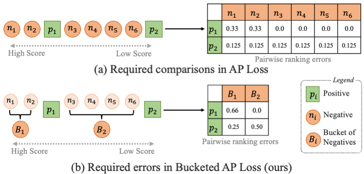

# Bucketed Ranking-based Losses for Efficient Training of Object Detectors

The official implementation of Bucketed Ranking-based Losses. Our implementation is based on [mmdetection](https://github.com/open-mmlab/mmdetection).

> [**Bucketed Ranking-based Losses for Efficient Training of Object Detectors**](https://arxiv.org/abs/2407.14204),            
> Feyza Yavuz, Baris Can Cam, Adnan Harun Dogan, [Kemal Oksuz](https://kemaloksuz.github.io/), [Emre Akbas](http://user.ceng.metu.edu.tr/~emre/), [Sinan Kalkan](http://www.kovan.ceng.metu.edu.tr/~sinan/),
> *ECCV 2024. ([arXiv pre-print](https://arxiv.org/abs/2407.14204))*


## Introduction

Bucketing for ranking-based losses enhances the efficiency of such losses in object detection by grouping negative predictions into buckets, significantly reducing the number of pairwise comparisons required during training. Bucketing maintains the alignment with evaluation criteria and robustness against class imbalance of ranking-based loss functions while drastically improving the time complexity.

<p align="center">
  
</p>


In this paper, we propose anovel bucketing approach to improve the efficiency of computationally-expensive ranking-based losses to train object detectors. 

## Model Zoo

## Running

### Install
We implement BucketedRankingBasedLosses using [MMDetection V2.25.3](https://github.com/open-mmlab/mmdetection/releases/tag/v2.25.3) and [MMCV V1.5.0](https://github.com/open-mmlab/mmcv/releases/tag/v1.5.0).
The source code of MMdetection has been included in this repo and you only need to build MMCV following [official instructions](https://github.com/open-mmlab/mmcv/tree/v1.5.0#installation).
We test our models under ```python=3.7.11,pytorch=1.11.0,cuda=11.3```. 

### Data
The COCO dataset and LVIS dataset should be organized as:
```
BucketedRankingBasedLosses
└── data
    ├── coco
    │   ├── annotations
    │   │      ├── instances_train2017.json
    │   │      └── instances_val2017.json
    │   ├── train2017
    │   └── val2017
    │
    └── lvis_v1
        ├── annotations
        │      ├── lvis_v1_train.json
        │      └── lvis_v1_val.json
        ├── train2017
        └── val2017        
```

### Training


### Testing


## Cite 

If you find this repository useful, please use the following BibTeX entry for citation.

```latex

```

## License

This project is released under the MIT license. Please see the [LICENSE](LICENSE) file for more information.
